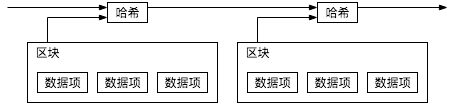
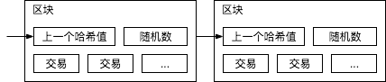
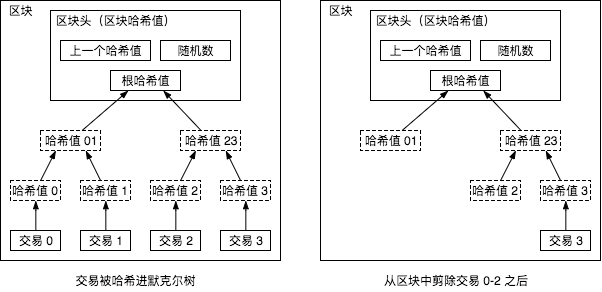

# 比特币：一种点对点的电子货币系统

Satoshi Nakamoto

satoshin@gmx.com

www.bitcoin.org

**摘要.** 一种纯粹的 `点对点（peer-to-peer）` 电子货币应当支持在线支付从付款方直接发送到收款方，而不需金融机构的参与。`数字签名（digital signatures）` 提供了部分电子货币的解决方案，但如果仍需一个可信任的第三方来防止 `双重支付（double-spending）`，那就失去了其主要优点。我们提出一种使用点对点网络解决 `双重支付` 问题的方案，该网络通过将交易 `哈希（hashing）` 进一条不断增长的基于哈希的 `工作量证明（proof-of-work）` 链来给交易打上时间戳，形成除非重做 `工作量证明` 所代表的工作否则不能更改的记录。最长的链不仅能证明其代表的事件序列，而且也能证明它本身是由最强 CPU `算力（power）` 池产生的。只要不会联合攻击网络的节点控制了 `占多数（majority）` 的 CPU `算力`，这些节点将会生成最长的链并超过攻击者。这种网络只需极简的架构。信息将被尽最大努力广播，节点可以随时离开和重新加入网络，重新加入时需接受当前最长 `工作量证明` 链作为它们离开时交易的证明。

## 1\. 简介

互联网贸易已经变得几乎完全依赖金融机构作为可信任的第三方来处理电子支付。尽管对于大部分交易这种系统运行得足够好，但仍有 `基于信任模型（trust based model）` 这个固有缺点。因为金融机构不可避免的需要调解争端，完全的 `不可撤销（non-reversible）` 交易实际是做不到的。调解成本增加了交易成本，限制了最小实际交易额度使日常小额交易成为不可能，并且由于缺乏不可撤销支付的能力，对不可撤销服务进行支付将需要更大的交易成本。由于存在交易撤销的可能性，因此需要更加广泛的信任前提。商家必须提防他们的客户，麻烦他们提供更多他本不必要的信息。一定比例的欺诈被认为是不可避免的。虽然使用实物货币可避免交易成本以及交易的不确定性，但是不存在不引入一个信任方而能在通信通道上进行支付的机制。

其实我们需要的是一个基于 `密码学原理（cryptographic proof）` 而不是基于信任的电子支付系统，该系统允许任何有交易意愿的双方能直接交易而不需要一个可信任的第三方。计算上不可撤销的交易将保护卖家不被欺诈，用来保护买家的 `程序化合约机制（routine escrow mechanisms）` 也应该较容易实现。在这篇论文中，我们提出一种使用点对点分布式 `时间戳服务器（timestamp server）` 生成基于时间序列的交易计算证明来解决 `双重支付` 问题的方案。只要诚实节点集体控制的 CPU `算力` 大于任意合作的攻击节点群的 CPU `算力`，这个系统就是安全的。

## 2\. 交易

我们定义一枚 `电子货币（electronic coin）` 就是一条数字签名链。当前货币拥有者通过将上一次交易和下一个拥有者的 `公钥（public key）` 的哈希值的数字签名添加到此货币末尾的方式将这枚货币转移给下一个拥有者。收款人可以通过验证数字签名来证实其为该链的所有者。

这里的问题是收款人不能验证货币的拥有者没有对此货币进行 `双重支付`。通常的做法是引入一个可信任的中央机构或 `造币厂（mint）` 来检查每笔交易是否存在 `双重支付`。每笔交易之后，都需要将这枚电子货币退回造币厂以换取发行一枚新的货币，只有由造币厂直接发行的货币才能被确认没有被 `双重支付`。这个方案的问题在于整个货币系统的命运都依赖于运营造币厂的公司，每笔交易都需要经过它们，就像银行一样。

我们需要一种能让收款人知道上一个货币拥有者没有对任何更早的交易签名。对我们来说，最早的那次交易是唯一有效的，所以我们不需要关心本次交易后面的 `双重支付` 尝试。唯一能保证一笔交易不存在的方法法是知晓所有之前的交易。在造币厂模型中，造币厂知晓所有交易并确定哪笔交易最先到达。在不引入一个可信任方的前提下要达到这个目的，所有交易就必须 `公开发布（publicly announced）`[1]，而且需要一个能让所有参与者达成交易顺序历史一致的系统。收款人在每笔交易时，都需要 `占多数` 的节点认同此交易是最先收到。

## 3\. 时间戳服务器

我们提出的方案从时间戳服务器开始。时间戳服务器计算包含数据项的 `区块（block）` 的哈希值来给其打时间戳并广泛的发布这个哈希值，就像在报纸或新闻组帖子里。时间戳能证明要得到这些数据的哈希值，显然这些数据当时一定是存在的。每个时间戳的哈希值都纳入了上一个时间戳，形成一条链，后面的时间戳进一步证实前一个时间戳。

## 4\. 工作量证明

为了实现一个基于点对点的时间戳服务器，我们需要使用一个类似 Adam Back 提出的 `哈希现金（hashcash）` 的 `工作量证明` 系统，而不是报纸或新闻组帖子那样。 `工作量证明` 采取查找一个数值，使得被哈希时，如使用 `SHA-256`，哈希值以数个 0 比特开始。平均所需工作量将随所需 0 比特位呈指数级增长，而对工作量验证却只需执行一次哈希就可以。

对于我们的时间戳网络。我们通过在 `区块` 中增加随机数直到使得 `区块` 的哈希值满足所需的 0 比特位的数被找到的方式实现 `工作量证明`。一旦 CPU 耗费了 `算力` 是 `工作量证明` 得到满足，那么除非重做这个工作就不能改变这个 `区块`。由于后面的 `区块` 是链接在这个 `区块` 后面的，改变这个 `区块` 就需要重做所有其后面的 `区块` 工作量。

`工作量证明` 同时解决了确定谁是代表 `占多数` 决定的问题。如果大多数是 `按 IP 地址投票（one-IP-address-one-vote）` 来决定，那么它将可能被能分配大量 IP 地址的人破坏。 `工作量证明` 本质上是 `按 CPU 投票（one-CPU-one-vote）`。最长的链代表了 `占多数` 决定，因为有最大量 `工作量证明` 的精力投入到这条链上。如果 `占多数` 的 CPU 算力被诚实节点控制，诚实的链就会增长的最快并超过其他的链。要修改过去的某区块，攻击者必须重做这个区块以及其后的所有区块的工作量证明从而赶上并超过诚实节点的工作。我们后面会证明随着后续的区块被添加一个更慢的攻击者赶上诚实节点的概率将呈指数级递减。

为了抵消硬件运算速度的增加及平衡不同时期运行节点的利益不一致，工作量证明的难度将由 `移动平均数（moving average）` 来得到每小时生成区块的平均数。如果区块生成得过块，那么生成的难度就会增加。

## 5\. 网络

网络按以下步骤运行：

1. 新交易向所有节点广播。
2. 每个节点将交易收集到一个区块。
3. 每个节点为它的区块寻找工作量证明。
4. 当一个节点找到了工作量证明，就向所有节点广播这个区块。
5. 节点只有在区块内所有交易都是有效的且之前没有被支付的情况下接收这个区块。
6. 节点通过使用某个区块的哈希值作为上一个哈希值在链中创建下一个区块的方式表示对这个区块的接受。

节点总是认为最长的链为正确的并继续工作来延长它。如果两个节点同时广播了不同的下一个区块，有些节点可能先收到其中一个而其他节点先收到另一个。这种情况，节点基于他们收到的第一个区块工作，但是也保存另一个分支以防它变为更长的链。当下一个工作量证明被找到后僵局就会被打破从而其中一个分支变得更长；在另一个分支上工作的节点将切换到更长的链。

新交易的广播不必到达所有的节点。只要到达足够多节点，就会进入到一个区块。区块广播也是能容忍消息丢失的。如果一个节点没有收到某个区块，它将在收到下一个区块时发现它丢失了某个区块然后去请求这个区块。

## 6\. 激励

为了方便，区块中的第一笔交易是区块创建者开启一枚属于他的货币的特殊的交易。这就增加了对支持网络的节点的激励，并提供了一种分发货币到流通市场的方法，因为这里没有中央机构来发行货币。新货币稳定的增加就像黄金矿工消耗资源并增加黄金到流通市场一样。对我们而言，消耗的是 CPU 时间和电力。

激励也可以由交易费用提供。如果交易的 `输出值（output）` 小于其 `输入值（input）` ，差价就作为交易费被加到包含此交易的区块的激励。一旦预定量的货币进入了流通市场，激励将变为只含有交易费，这样可以完全地避免通胀。

激励有助于鼓励节点保持诚实。如果一个贪心的攻击者有能力聚集比所有诚实节点更多的 CPU 算力，他将面临选择以骗回已付款的方式欺诈别人，或选择使用这些算力生成新的货币。他将发现遵守系统规则对他更有利，这些规则将准许他获得比所有其他人更多的新货币，这比颠覆系统并使他自己在系统中财产失效更好。

## 7\. 回收磁盘空间

一旦某个货币的最新的交易已经纳入足够多的区块，这之前的交易就可以被丢弃以节省磁盘空间。为实现此功能而又不破坏区块的哈希值，交易将被哈希进 `默克尔树（Merkle Tree）`[7][2][5]，只有根节点被纳入到区块的哈希值。老的区块可通过剪除树枝的方式被压缩。树枝内部的哈希不需要被保存。

每个不包含交易的区块头大约是 80 字节。如果每十分钟生成一个区块，每年生成 `80 bytes * 6 * 24 * 365 = 4.2 MB`，2008 年在售的典型计算机有 2 GB 内存，并且 `摩尔定律（Moore's Law）` 预测目前每年内存增加 1.2 GB，所以就算区块头要存在内存里也不是问题。

## References

[1] W. Dai, "b-money," <http://www.weidai.com/bmoney.txt>, 1998.

[2] H. Massias, X.S. Avila, and J.-J. Quisquater, "Design of a secure timestamping service with minimal trust requirements," In 20th Symposium on Information Theory in the Benelux, May 1999.

[3] S. Haber, W.S. Stornetta, "How to time-stamp a digital document," In Journal of Cryptology, vol 3, no 2, pages 99-111, 1991.

[4] D. Bayer, S. Haber, W.S. Stornetta, "Improving the efficiency and reliability of digital time-stamping," In Sequences II: Methods in Communication, Security and Computer Science, pages 329-334, 1993.

[5] S. Haber, W.S. Stornetta, "Secure names for bit-strings," In Proceedings of the 4th ACM Conference on Computer and Communications Security, pages 28-35, April 1997.

[6] A. Back, "Hashcash - a denial of service counter-measure," <http://www.hashcash.org/papers/hashcash.pdf>, 2002.

[7] R.C. Merkle, "Protocols for public key cryptosystems," In Proc. 1980 Symposium on Security and Privacy, IEEE Computer Society, pages 122-133, April 1980.

[8] W. Feller, "An introduction to probability theory and its applications," 1957.

占多数 算力 区块 工作量证明 移动平均数 哈希 激励 输出值 输入值
