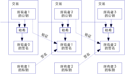
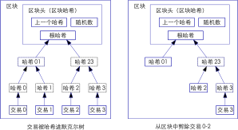
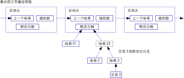

比特币：一种点对点电子现金系统

Satoshi Nakamoto

satoshin@gmx.com

www.bitcoin.org

一种完全的点对点电子现金应当允许在线支付从一方直接发送到另一方而不需要通过一个金融机构。数字签名提供了部分解决方案，但如果仍需一个可信任第三方来防止双重支付，那就失去了电子货币的主要优点。我们提出一种使用点对点网络解决双重支付问题的方案。该网络通过将交易哈希进一条持续增长的基于哈希的工作量证明链来给交易打上时间戳，形成一条除非重做工作量证明否则不能更改的记录。最长的链不仅是被见证事件序列的证据，而且也是它本身是由最大 CPU 算力池产生的证据。只要多数的 CPU 算力被不打算联合攻击网络的节点控制，这些节点就将生成最长的链而超过攻击者。这种网络本身只需极简的架构。信息将被尽力广播，节点可以随时离开和重新加入网络，只需接受最长的工作量证明链作为它们离开时发生事件的证据。

# 简介

互联网贸易已经变得几乎完全依赖金融机构作为可信任第三方来处理电子支付。尽管对于大部分交易这种系统运行得足够好，但仍需忍受基于信任模型这个固有缺点。由于金融机构不可避免的需要仲裁纠纷，完全的不可撤销交易实际是做不到的。仲裁成本增加了交易成本，限制了最小实际交易额度从而杜绝了日常小额交易的可能性，而且由于不支持不可撤销支付，对不可撤销服务进行支付将需要更大的成本。由于存在交易被撤销的可能性，对于信任的需求将更广泛。商家必须警惕他们的客户，麻烦他们提供更多他本不必要的信息。一定比例的欺诈被认为是不可避免的。虽可通过当面使用实物货币来避免这些成本及支付的不确定性，但不存在不引入一个可信任方而能在通信通道上进行支付的机制。

我们需要的是一个基于密码学原理而不是信任的电子支付系统，该系统允许任何有交易意愿的双方能直接交易而不需要一个可信任第三方。交易在计算上的不可撤销将保护卖家不被欺诈，用来保护买家的程序化合约机制也应该较容易实现。在这篇论文中，我们提出一种使用点对点分布式时间戳服务器为基于时间的交易序列生成计算上的证据来解决双重支付问题的方案。只要诚实节点集体控制的 CPU 算力大于每一个合作攻击节点群的 CPU 算力，这个系统就是安全的。

# 交易

我们定义一枚电子货币就是一条数字签名链。每个拥有者都通过将上一次交易和下一个拥有者的公钥的哈希值的数字签名添加到此货币末尾的方式将这枚货币转移给下一个拥有者。收款人可以通过验证数字签名来证实其为该链的所有者。



这里的问题是收款人不能证实拥有者之一没有对此货币进行双重支付。通常的做法是引入一个可信任的中央机构或铸币厂来检查每笔交易是否存在双重支付。每笔交易之后，都需要将这枚货币退回铸币厂以换取发行一枚新的货币，只有由铸币厂直接发行的货币才能被确认没有被双重支付。这个方案的问题在于整个货币系统的命运都依赖于运营铸币厂的公司，每笔交易都需要经过它们，就像银行一样。

我们需要一种能让收款人知道上一个货币拥有者没有对任何更早的交易签名的方法。对我们来说，最早的那次交易是唯一有效的，所以我们不需要关心本次交易后面的双重支付尝试。唯一能确保一笔交易不存在的方法是知晓所有之前的交易。在铸币厂模型中，铸币厂知晓所有交易并能确定哪笔交易最先到达。在不引入一个可信任方的前提下要达到这个目的，所有交易就必须公开发布 [1]，而且需要一个能让所有参与者对交易收到顺序的单一历史达成共识的系统。收款人在每笔交易时，都需要多数节点认同此交易是最先收到的证据。

# 时间戳服务器

我们提出的方案从时间戳服务器开始。时间戳服务器计算包含多个需要被打时间戳的项目的区块的哈希值并广泛地发布这个哈希值，就像在报纸或新闻组帖子里 [2-5]。时间戳能证明要得到这个哈希值，显然这些数据当时一定是存在的。每个时间戳的哈希值都纳入了上一个时间戳，形成一条链，后面的时间戳进一步增强前一个时间戳。


# 工作量证明

为了实现一个基于点对点的时间戳服务器，我们需要使用一个类似 Adam Back 提出的哈希货现金 [6] 的工作量证明系统，而不是报纸或新闻组帖子那样。工作量证明采取搜索一个数，使得被哈希时，如使用 SHA-256，得到的哈希值以数个 0 比特开始。平均所需工作量将随所需 0 比特呈指数级增长而验证却只需执行一次哈希。

对于我们的时间戳网络。我们通过在区块中加入一个随机数，直到使得区块的哈希值满足所需 0 比特的数被找到的方式实现工作量证明。一旦消耗了 CPU 算力使区块满足了工作量证明，那么除非重做这个工作否则就无法更改区块。由于后面的区块是链接在这个区块后面的，改变这个区块将需要重做所有后面的区块。


工作量证明同时解决了在多数决定中确定投票方式的问题。如果多数是按 IP 地址投票来决定，那么它将可能被能分配大量 IP 地址的人破坏。工作量证明本质上是按 CPU 投票。最长的链代表了多数决定，因为有最大的计算工作量证明的精力投入到这条链上。如果多数的 CPU 算力被诚实节点控制，诚实的链就会增长得最快并超过其他的竞争链。要修改过去的某区块，攻击者必须重做这个区块以及其后的所有区块的工作量证明从而赶上并超过诚实节点的工作。我们后面会证明随着后续的区块被添加一个更慢的攻击者赶上诚实节点的概率将呈指数级递减。

为了抵消硬件运算速度的增加及平衡不同时期运行节点的利益，工作量证明的难度将由移动平均数法来确定每小时生成区块的平均数。如果区块生成得过快，那么生成的难度就会增加。

# 网络

运行网络的步骤如下：

1. 新交易向所有节点广播。

2. 每个节点将新交易收集到一个区块。

3. 每个节点为它的区块寻找工作量证明。

4. 当一个节点找到了工作量证明，就向所有节点广播这个区块。

5. 节点只有在区块内所有交易都是有效的且之前没有被支付的情况下接收这个区块。

6. 节点通过使用这个区块的哈希值作为上一个哈希值在链中创建下一个区块的方式表示对这个区块的接受。

节点总是认为最长的链为正确的并持续致力于延长它。如果两个节点同时广播了不同的下一个区块，有些节点可能先收到其中一个而其他节点先收到另一个。这种情况，节点基于他们收到的第一个区块工作，但是也保存另一个分支以防它变为更长的链。当下一个工作量证明被找到后僵局就会被打破从而其中一个分支变得更长；在另一个分支上工作的节点将切换到更长的链上来。

新交易的广播不必到达所有的节点。只要到达一些节点，不久就会进入到一个区块。区块广播也是能容忍消息丢失的。如果一个节点没有收到某个区块，它将在收到下一个区块时发现它丢失了一个区块然后去请求这个区块。

# 激励

我们约定，区块中的第一笔交易是区块创建者开启一枚属于他的新货币的特殊的交易。这就增加了对支持网络的节点的激励，并提供了一种分发货币到流通领域的方法，因为这里没有中央机构来发行货币。新货币按固定量稳定地增加就像金矿矿工消耗资源并增加黄金到流通领域一样。对我们而言，消耗的是 CPU 时间和电力。

激励也可以由交易费充当。如果交易的输出值小于其输入值，差价就作为交易费被加到包含此交易的区块的激励中。一旦预定量的货币进入了流通领域，激励将变为只含有交易费，这样可以完全避免通货膨胀。

激励会有助于鼓励节点保持诚实。如果一个贪心的攻击者有能力聚集比所有诚实节点更多的 CPU 算力，他将面临是以骗回已付款的方式欺诈别人还是使用这些算力生成新货币的抉择。他将发现遵守规则比破坏系统和他自己财产的有效性更有利，因为这些规则准许他获得比所有其他人都多的新货币。

# 回收磁盘空间

一旦某个货币的最新交易已经被足够多的区块覆盖，这之前的支付交易就可以被丢弃以节省磁盘空间。为便于此而又不破坏区块的哈希值，交易将被哈希进默克尔树 [7][2][5]，只有根节点被纳入到区块的哈希值。老的区块可通过剪除树枝的方式被压缩。树枝内部的哈希不需要被保存。



每个不包含交易的区块头大约是 80 bytes。如果每 10 分钟生成一个区块，每年生成 80 bytes _6_ 24 * 365 = 4.2 MB，2008 年在售的典型计算机有 2 GB 内存，并且摩尔定律预测目前每年内存增加 1.2 GB，所以就算区块头一定要存在内存里，存储也不是问题。

# 简化的支付验证

不运行一个完整的网络节点也是可以进行支付验证的。用户只需拥有一个最长工作量证明链的区块头副本，他可以通过向其他网络节点查询以确认他拥有了最长的链，并获取链接交易到给交易打时间戳区块的默克尔分支。虽然他自己不能核实这个交易，但如果交易已经链接到到链中的某个位置，就说明一个网络节点已经接受了此交易，而其后追加的区块进一步确认网络已经接受了它。



同样地，只要诚实节点控制着网络这种简化验证就是可靠的，如果网络被攻击者控制简化验证会变得比较脆弱。虽然网络节点可以验证他们自己的交易，但只要攻击者持续控制网络那么这种简化的方法就可能被攻击者的伪造交易欺骗。一种对策是接受其他网络节点发现一个无效区块时发出的警告，提醒用户软件下载整个区块和被警告的交易来检查一致性。为了更加独立的安全性以及更快的支付确认，收款频繁的公司可能仍需运行他们自己的节点。

# 合并和分割交易额

尽管单独处理每个货币是可行的，但将一次转账按每一分拆成多次交易是笨拙的。为允许交易额被分割和合并，交易将包含多个输入值和输出值。通常是一个从之前交易而得的较大输入值或多个较小输入值的组合，以及最多两个输出值：一个作为支付，另一个作为找零，如果有的话，退还给支付发送方。


注意这里的扇出，即一笔交易依赖数笔交易，这数笔交易又依赖更多的交易，在这里是不存在问题的。永远不会需要获取一笔交易历史的完整独立副本。

# 隐私

传统的银行模型通过限制参与方和可信任第三方对信息的访问来达到一定级别的隐私。交易必须要公开发布就不能使用这个方法，但隐私仍可在其他地方通过阻断信息流的方式来保护：那就是保持公钥匿名。公众能看到有人正在发送一定量货币给其他人，但是不能将交易关联到某个人。这和证券交易所发布的信息级别类似，每笔交易的时间和交易量，即行情是公开的，但是不会显示交易双方是谁。


作为额外的防火墙，对每笔交易使用新密钥对可以防止他们被关联到一个共同的拥有者。由于多输入值交易存在，有些关联仍不可避免，因为多输入值交易必然暴露其多个输入是属于同一个拥有者的。风险就在于如果一个密钥的拥有者被暴露，关联性将暴露其他属于同一个拥有者的交易。

# 计算

我们考虑一个攻击者试图生成一条比诚实链更快的替代链的情况。即使这个目标达到了，也不会使系统变得可以任意修改，比如凭空创建货币或拿走不属于他的钱。节点将不会接受无效的交易作为支付，而且诚实节点永远不会接受一个包含无效交易的区块。攻击者只可能改变他自己的某笔交易来拿回他不久前已经支出的钱。

诚实链与攻击者链之间的竞争可描述为二项随机漫步。成功事件是诚实节点被延长一个区块，两条链的差距加 1，失败事件是攻击者的链延长一个区块，两条链的差距减 1。

攻击者从某一落后位置赶上诚实链的概率类似于赌徒破产理论。设想一个拥有无限信用的赌徒从一定亏损开始，进行可能无限次的赌博试图达到盈亏平衡。我们可以计算他达到盈亏平衡，即一个攻击者赶上诚实链的概率，如下 [8]：


我们假设 `p > q`，概率将随着攻击者需要赶上的区块数增加而呈指数下降。 由于形势对他不利，如果他没有在早期幸运地快速赶上，他落得越远赶上的机会就越渺茫。

我们现在考虑一个新交易的收款人要等多久才能确保付款人不能再改变这个交易。我们假设付款人是想让收款人相信他暂时已经付款，然后在一段时间后改变成支付回他自己。这时收款人会收到警告，但付款人希望警告已为时已晚。

收款人生成一个新密钥对并将公钥给付款人，这样付款人就无法提前对交易签名。这能防止付款人通过持续工作直到他足够幸运获得大幅领先的方式预先准备一条区块链，然后执行交易。一旦交易被发出，不诚实的付款人就开始秘密地在一条包含了他的替换版交易的平行链上工作。

收款人等到交易被加到区块中且其后追加了 `z` 个区块。他不知道攻击者确切的进度，但是假设诚实的区块按期望的平均时间生成，攻击者可能的进度将是一个泊松分布，其期望值为：


为计算攻击者现在仍然能赶上的概率，我们给每个他可能达到的进度的泊松密度乘以他在那个进度能赶上诚实链的概率：


变换以避免对分布的无限尾部求和...


转换成 C 语言代码...

```
#include <math.h>
double AttackerSuccessProbability(double q, int z) {
  double p = 1.0 - q;
  double lambda = z _ (q / p);
  double sum = 1.0;
  int i, k;
  for (k = 0; k <= z; k++) {
    double poisson = exp(-lambda);
    for (i = 1; i <= k; i++)
      poisson _= lambda / i;
    sum -= poisson \* (1 - pow(q / p, z - k));
  }
  return sum;
}
```

运行得到一些结果结果，我们可以看到概率随 `z` 呈指数下降。

```
q=0.1
z=0 P=1.0000000
z=1 P=0.2045873
z=2 P=0.0509779
z=3 P=0.0131722
z=4 P=0.0034552
z=5 P=0.0009137
z=6 P=0.0002428
z=7 P=0.0000647
z=8 P=0.0000173
z=9 P=0.0000046
z=10 P=0.0000012
```

```
q=0.3
z=0 P=1.0000000
z=5 P=0.1773523
z=10 P=0.0416605
z=15 P=0.0101008
z=20 P=0.0024804
z=25 P=0.0006132
z=30 P=0.0001522
z=35 P=0.0000379
z=40 P=0.0000095
z=45 P=0.0000024
z=50 P=0.0000006
```

`P` 小于 0.1\% 的解...

```
P < 0.001
q=0.10 z=5
q=0.15 z=8
q=0.20 z=11
q=0.25 z=15
q=0.30 z=24
q=0.35 z=41
q=0.40 z=89
q=0.45 z=340
```

# 总结

我们已经提出了一种不依赖信任的电子交易系统。我们从通用的数字签名货币体系开始，这体系提供了强有力的所有权控制，但由于缺乏防止双重支付的方法而不完善。为解决这个问题，我们提出一种使用工作量证明来记录公共交易历史的点对点网络，只要诚实节点控制了多数的 CPU 算力，对于对攻击者，交易历史将很快变得在计算上不可更改。网络因其结构简洁性而健壮。节点只需很少的协调就能同时工作。它们不需要被认证，因为信息不会被发送到某个特殊的位置，只需被尽力传播。节点可以随时离开和重新加入网络，只需接受最长的工作量证明链作为它们离开时发生事件的证据。节点使用 CPU 算力来投票，通过致力于延长有效区块来表达对其接受，通过拒绝在无效区块上工作来表达对其抵制。任何需要的规则和激励都可通过这个共识机制来加强。

# References

1. W. Dai, "b-money," <http://www.weidai.com/bmoney.txt>, 1998.

2. H. Massias, X.S. Avila, and J.-J. Quisquater, "Design of a secure timestamping service with minimal trust requirements," In _20th Symposium on Information Theory in the Benelux_, May 1999.

3. S. Haber, W.S. Stornetta, "How to time-stamp a digital document," In _Journal of Cryptology_, vol 3, no 2, pages 99-111, 1991.

4. D. Bayer, S. Haber, W.S. Stornetta, "Improving the efficiency and reliability of digital time-stamping," In _Sequences II: Methods in Communication, Security and Computer Science_, pages 329-334, 1993.

5. S. Haber, W.S. Stornetta, "Secure names for bit-strings," In _Proceedings of the 4th ACM Conference on Computer and Communications Security_, pages 28-35, April 1997.

6. A. Back, "Hashcash - a denial of service counter-measure," <http://www.hashcash.org/papers/hashcash.pdf>, 2002.

7. R.C. Merkle, "Protocols for public key cryptosystems," In _Proc. 1980 Symposium on Security and Privacy_, IEEE Computer Society, pages 122-133, April 1980.

8. W. Feller, "An introduction to probability theory and its applications," 1957.
