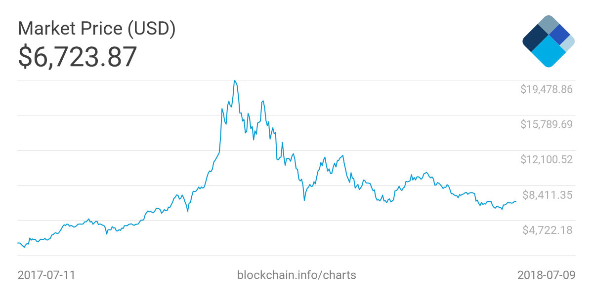
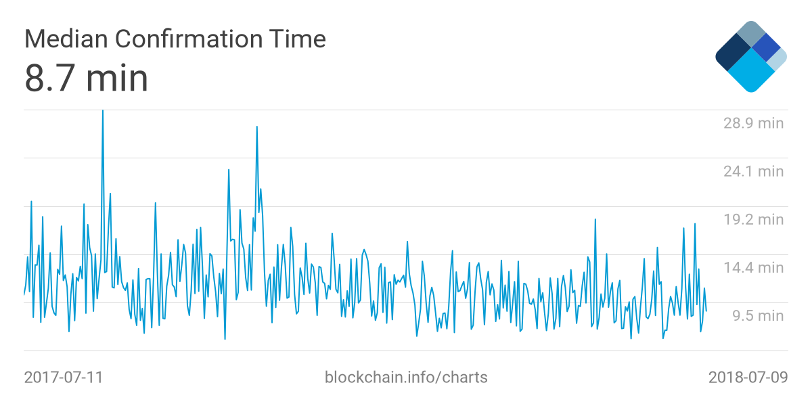

当初次听到别人谈论比特币时，我认为这是个伟大的发明，能解决一些现实社会特别是信任的问题，但后来仔细分析它，我发现其实不是那么简单。在我看来，比特币存在不少问题，有的甚至是相当致命的，我把这些问题列出来，供参考讨论。

## 政府不接受

由于比特币固有的难以监管的特性，政府是不太可能主动接受的，虽然大部分国家没有立法禁止使用比特币，但大部分主要国家都对比特币进行了限制，认为它是一种证券，只有少数国家接受其作为支付货币。

之前对比特币持开放太多的国家也越来越谨慎，如最近韩国司法部表示，正在准备一项法案，以禁止所有加密货币交易；美国多家银行宣布禁止使用信用卡购买加密货币。

试想如果比特币继续发展而威胁到了各国央行实现对经济的调控，那政府是不可能不出手的。

## 总币量固定

比特币的总量是 2100 万个，这样设计是为了避免通货膨胀，但是这会使可用的比特币越来越少，因为人们不可避免的会丢失比特币，如不小心忘记私钥，意外火灾烧毁存储私钥的电脑等。

中本聪的比特币钱包里的 50 个比特币，自其退隐后就一直没动过，假设中本聪已经离开了地球，那么这 50 个比特币就永远退出了比特币流通领域。

总币量固定甚至减少，另一方面，世界经济总量又是发展的，人们就会认为比特币有升值预期，交易意愿就一定程度会被抑制，这会进一步导致缺乏流动性，也就是通货紧缩，这比通货膨胀更严重。

## 缺乏稳定性

比特币的大幅波动大家是见惯不怪了，我们看一下最近一年的比特币对美元走势图：

试想一个国家的法币这样波动，那这个国家一定是会陷入严重的危机。

各国央行的重要任务之一就是维护本国货币的基本稳定，显而易见像比特币这样是不可能成为主流的法定货币的。

## 使用场景少

目前很大一部分购买比特币的人都是投机心态，他们根本没去了解比特币的原理，或者根本不想了解。他们买比特币的唯一目的是期望它升值，然后卖给后来的人，几乎没有人是因为比特币交易方便而去购买比特币的，我见过不少用人民币买比特币的，但没见过用比特币买咖啡的。

## 交易成本高

中本聪在比特币白皮书里提出比特币主要目标之一就是为了方便小额支付。然而这是显然没有达到的，现在比特币的每笔交易都需要交易费，甚至有些网站提示不推荐小额转账。目前矿工除了交易费之外还有挖到新比特币的收入，如果以后比特币挖完了，那么将只有交易费的收入，那么交易费会不会有上涨呢？

另一方面，交易确认时间也很长，这是由于其去中心化网络结构决定的，几乎无法优化，最近半年交易时间平均是 8.7 分钟，长的可能达到 10 多分钟，如图：

试想我去 7-Eleven 买一瓶矿泉水，支付时店员要我等 10 分钟确认，这是不可接受的。目前我们使用的微信支付，支付宝几乎都是秒确认的，而且不需要手续费，所以为什么要用比特币呢。

## 安全性风险

2014 年 2 月，当时最大的比特币交易所 Mt.Gox 被盗 85 万个比特币（75 万属于客户，10 万属于公司自有），按当时比特币价格相当于 4.5 亿美元，直接导致 Mt.Gox 破产。

2016 年 8 月，Bitfinex 被盗走 12 万枚比特币，按当时比特币价格相当于 7200 万美元。

2018 年 3 月，黑客用盗取的币安（Binance）用户的账号密码，控制了大约 1 万个比特币，用着这些比特币将另一种数字货币 VIA 的价格拉高 100 倍，据传黑客可获利数十亿。

2018 年 6 月，韩国最大比特币交易所 Coinrail 被黑，价值 3000 万美元数字货币被盗。

比特币是用通过保存私钥来持有的，如果用户把私钥存在离线的电脑上就有可能因为电脑损坏而丢失；如果存在第三方公司的服务器上，又有被盗的风险。无论怎样选择都难避免安全性的问题。

## 没有护城河

其实之前就有不少人看到了比特币的缺点，于是他们创立了大量的新数字货币，这些新数字货币良莠不齐，有些确实有一些比比特币更好的特性，另一些完全就是骗局，但不管属于哪一种，都会对比特币构成冲击。如果人人都可以发币，必然是这些币都没有价值。

## 比特币的未来

未来是无法预测的，这里猜一下比特币的结局。

随着人们越来越了解比特币，而不是听别人的忽悠，有理由相信比特币这个泡沫会破灭，但是作为毕竟曾经达到每个 2 万美元，而且是人类历史上第一个真正意义上的数字货币，我想比特币不会变得一文不值，它最后会沦为一种纪念币流传下去，那么价格到底会跌到多少呢？大胆的猜一下这个价格会低于 100 美元。
